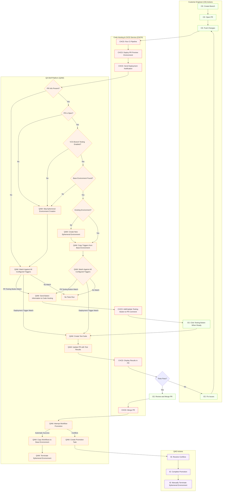
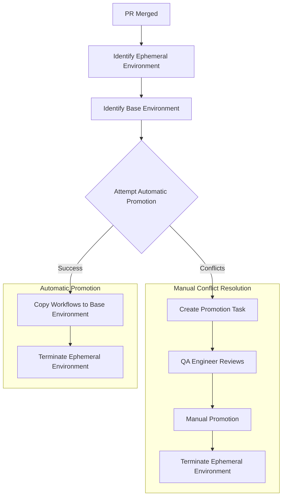

## 1. Introduction

Welcome to the QA Wolf CI/CD Integration Guide 3.0. This comprehensive guide is designed to help you seamlessly integrate QA Wolf into your CI/CD pipeline, ensuring automated, reliable, and high-quality test execution for your applications.

### Who Should Use This Guide?

This guide serves two primary audiences:

- **Integration Engineers:** Technical team members responsible for configuring QA Wolf, setting up environments, triggers, and integration settings.
- **Customer Engineers:** Developers and QA professionals who need to integrate their CI/CD pipelines with QA Wolf for automated testing.

Different sections of this guide are designed to address the needs of both audiences, from basic setup to advanced configurations.

### How to Use This Guide

This guide is organized to progress from simple to complex topics:
<Steps>
<Step>
Start with the **Quick Start Guide** to get a basic integration running quickly
</Step>
<Step>
Learn the **Core Concepts** to understand how QA Wolf works
</Step>
<Step>
Explore **Common Integration Patterns** for typical use cases
</Step>
<Step>
Dive into specific **Integration Methods** for your technology stack
</Step>
<Step>
Configure **Environments** and **Triggers** for your specific needs
</Step>
<Step>
Refer to **Troubleshooting** and **Technical Reference** sections as needed
</Step>
</Steps>
Let's begin with a quick integration to get you started!

## 2. Quick Start Guide

This section will help you quickly set up a basic integration between your CI/CD pipeline and QA Wolf. We'll use GitHub Actions as an example, but the concepts apply to all integration methods.

### Basic GitHub Actions Integration

<Tip>
This relies on [GitHubNotify QA Wolf on Deploy - GitHub Marketplace](https://github.com/marketplace/actions/notify-qa-wolf-on-deploy)​
</Tip>

<Warning>
Don’t forget to [Install GitHub/GitLab App](/qawolf/Install-GitHub-GitLab-App-47cc1ec73f564808b73333b36ef85a11)
</Warning>

Add the following step to your GitHub workflow file (e.g., `.github/workflows/deploy.yml`):

```yaml YAML
name: Deploy and Notify QA Wolf
on:
  push:
    branches:
      - main
jobs:
  deploy:
    name: Deploy Application
    runs-on: ubuntu-latest
    steps:
      # Your existing deployment steps here
      - name: Deploy to production
        run: your-deployment-command

      # Add this step to notify QA Wolf
      - name: Notify QA Wolf
        uses: qawolf/notify-qawolf-on-deploy-action@v1
        env:
          GITHUB_TOKEN: "${{ secrets.GITHUB_TOKEN }}"
        with:
          qawolf-api-key: "${{ secrets.QAWOLF_API_KEY }}"
          deployment-type: "production"
          deployment-url: "https://your-production-app.com"
```

#### What This Does

<Steps>
<Step>
When code is pushed to the `main` branch, your deployment pipeline runs
</Step>
<Step>
After deployment completes, the QA Wolf notification step runs
</Step>
<Step>
QA Wolf receives the deployment notification with details about your deployment
</Step>
<Step>
If you have configured triggers in QA Wolf, tests will automatically run against your deployed application
</Step>
<Step>
Results will be available in the QA Wolf dashboard
</Step>
</Steps>
#### Setting Up Your API Key

<Steps>
<Step>
Log in to QA Wolf and navigate to your team settings
</Step>
<Step>
Copy your API key
</Step>
<Step>
Add this key as a secret in your GitHub repository settings named `QAWOLF_API_KEY`
</Step>
</Steps>

#### Verifying the Integration

<Steps>
<Step>
After setting up the integration:
</Step>
<Step>
Push a change to your main branch
</Step>
<Step>
Check that your deployment completes successfully
</Step>
<Step>
Log in to QA Wolf and verify that a test suite was created
</Step>
<Step>
Review the test results in the QA Wolf dashboard
</Step>
</Steps>

Congratulations! You've set up a basic integration between your CI/CD pipeline and QA Wolf. In the next section, we'll explore the core concepts that power this integration.

#### Other Integration Methods

While GitHub Actions is a common integration method, QA Wolf supports multiple ways to connect with your CI/CD pipeline:

- **QA Wolf SDK:* For programmatic integration with any CI/CD system that supports JavaScript/TypeScript. Learn more in section 5.2.
- **Fastlane Plugin:** For mobile application teams using Fastlane for CI/CD. Learn more in section 5.3.
- **REST API:** For direct API integration with custom build systems. Learn more in section 10.1.

Choose the integration method that best fits your technology stack and workflow requirements.

## 3. Core Concepts

To effectively use QA Wolf with your CI/CD pipeline, it's helpful to understand a few key concepts. This section provides a simplified overview of the most important elements.

### Deployments

A **deployment** represents a specific version of your application released to an environment. When you notify QA Wolf about a deployment, you're essentially saying: "I've just deployed my application, please run tests against it."

Key deployment information includes:

- The QA Wolf environment (automatically detected by QA Wolf)
- The branch that was deployed
- The URL where the application is accessible
- The commit SHA for version tracking

### Environments

An **environment** in QA Wolf represents a place where your application runs. QA Wolf supports two types of environments:

- **Static Environments:** Permanent environments like production, staging, and development
- **Ephemeral Environments:** Temporary environments created for pull requests

Each environment can have its own configuration, including environment variables and triggers.

### Triggers

**Triggers** are rules that determine when tests should run. They connect deployments to test executions based on conditions you define.

The two main types of triggers are:

- **Deployment Triggers:** Automatically run tests when a deployment matches certain criteria (branch, environment, etc.)
- **PR Testing Button Triggers:** Add manual test buttons to pull request comments for on-demand testing

### Test Suites and Workflows

When a trigger's conditions are met, QA Wolf creates and executes a **test suite**. A test suite contains one or more **workflows**, which are the actual test definitions that verify your application's functionality.

Workflows are:

- Versioned and portable between environments
- Configurable via environment variables
- Promotable from ephemeral to static environments

### Environment Variables

**Environment variables** configure how tests run and can be defined at multiple levels:

- In QA Wolf's environment configuration
- In the deployment notification payload
- At runtime during test execution

The most important environment variable is typically `URL`, which tells QA Wolf where to find your application.

### Code Hosting Integration

QA Wolf integrates with services like GitHub and GitLab to provide:

- Automatic PR comments with test results
- Commit status checks
- PR testing buttons
- Workflow promotion when PRs are merged

This integration creates a seamless developer experience with test feedback directly in your workflow.

Now that you understand the core concepts, the next section will cover common integration patterns for different testing scenarios.

## 4. Common Integration Patterns

QA Wolf can be integrated with your CI/CD pipeline in several ways, depending on your testing needs. This section covers the most common integration patterns, from simple to more complex.

### Testing Static (Production, Staging, Development) Deployments

The simplest integration pattern is testing your production environment after each deployment:

1. **Setup:**
    - Create a static environment in QA Wolf for production
    - Configure a deployment trigger with conditions matching your production branch
    - Add QA Wolf notification to your production deployment pipeline
2. **Flow:**
    - You deploy to production
    - Your CI/CD pipeline notifies QA Wolf
    - QA Wolf automatically runs tests against your production environment
    - Results are available in the QA Wolf dashboard

This pattern ensures your production environment is always tested after deployment, providing confidence that critical functionality works as expected.

### Test Pull Requests

#### On Demand

Testing pull requests before merging helps catch issues early in the development process:

1. **Setup:**
    - Enable VCS Branch Testing in QA Wolf
    - Configure a base environment linked to your main branch
    - Create a PR Testing Button trigger
    - Add QA Wolf notification to your PR preview deployment pipeline
2. **Flow:**
    - Developer creates a pull request
    - Your CI/CD pipeline deploys a preview environment
    - Your CI/CD pipeline notifies QA Wolf
    - QA Wolf adds a test button to the PR comment
    - Developer clicks the button when ready to test
    - QA Wolf runs tests and updates the PR with results

This pattern allows developers to test changes in isolation before merging, reducing the risk of introducing bugs to your main branch.

#### Automated PR Testing

For teams that want fully automated PR testing:

1. **Setup:**
    - Enable VCS Branch Testing in QA Wolf
    - Configure a base environment linked to your main branch
    - Create a deployment trigger for PR environments
    - Add QA Wolf notification to your PR preview deployment pipeline
2. **Flow:**
    - Developer creates a pull request
    - Your CI/CD pipeline deploys a preview environment
    - Your CI/CD pipeline notifies QA Wolf
    - QA Wolf automatically runs tests against the PR environment
    - Results are posted as comments on the PR

This pattern provides immediate feedback on every PR change without requiring manual intervention.

#### Custom PR Testing

For teams that want to customize when tests run:

1. **Setup:**
    - Enable VCS Branch Testing in QA Wolf
    - Configure a base environment linked to your main branch
    - Create a deployment trigger for PR environments
    - Define a custom CI rule to notify QA Wolf, for example, when a label is added to a PR

2. **Flow:**
    - Developer creates a PR
    - Your CI/CD pipeline deploys a preview environment
    - Developer adds a label to the PR
    - Your CI/CD pipeline notifies QA Wolf
    - QA Wolf runs the test suites
    - Results are posted as comments on the PR

This pattern allows teams to customize when tests run based on their specific needs, while still benefiting from the benefits of PR testing.

## 5. Integration Methods

QA Wolf provides multiple methods to integrate with your CI/CD pipeline. This section covers each method in detail, with examples and configuration options.

### GitHub Actions Integration

GitHub Actions provides a simple way to integrate QA Wolf into your GitHub-based workflows.

#### Check it at [<Icon icon="github"/> GitHubNotify QA Wolf on Deploy - GitHub Marketplace](https://github.com/marketplace/actions/notify-qa-wolf-on-deploy)​

#### Basic Setup

Add the QA Wolf GitHub Action to your workflow file:

```yaml YAML expandable
name: Deploy and Notify QA Wolf
on:
  push:
    branches:
      - main
jobs:
  deploy-environment:
    name: Your custom job to deploy
    uses: ./your-custom-action

  wait-for-deployment:
    name: Wait for deployment to be ready
    uses: ./your-custom-action

  notify:
    needs: wait-for-deployment
    name: Trigger QA Wolf
    runs-on: ubuntu-latest
    steps:
      - name: Notify QA Wolf of deployment
        uses: qawolf/notify-qawolf-on-deploy-action@v1
        env:
          GITHUB_TOKEN: "${{ secrets.GITHUB_TOKEN }}"
        with:
          qawolf-api-key: "${{ secrets.QAWOLF_API_KEY }}"
          deployment-url: ${{ needs.deploy-environment.outputs.deployment-url || "https://static-url.com" }}
          deployment-type: production
```

#### GitHub Action Parameters

| Parameter | Required | Description |
|:--- |:--- |:--- |
| `qawolf-api-key` | Yes | Your QA Wolf API key from team settings |
| `deployment-type` | No | The deployment type (e.g., "production", "staging", "preview") |
| `deployment-url` | No | The URL of the deployed application to test |
| `branch` | No | The branch that was deployed (auto-extracted from GitHub context) |
| `sha` | No | The commit SHA (auto-extracted from GitHub context) |
| `pull-request-number` | No | The PR number for PR testing (auto-extracted from GitHub context) |
| `variables` | No | JSON-formatted environment variables for tests |
| `deduplication-key` | No | Custom key to prevent duplicate test runs |

### QA Wolf SDK Integration

For non-GitHub CI/CD systems or custom integrations, the QA Wolf SDK provides a programmatic way to integrate with QA Wolf.

#### Check it at [<Icon icon="npm"/> npmnpm: @qawolf/ci-sdk](https://www.npmjs.com/package/@qawolf/ci-sdk)​

#### Installation

```bash
npm install @qawolf/ci-sdk
```

#### Basic Usage

```js TypeScript
import { makeQaWolfSdk } from "@qawolf/ci-sdk";

// Setup the SDK with your API key
const { attemptNotifyDeploy } = makeQaWolfSdk({
  apiKey: "qawolf_xxxxx",
});

// For standard deployment notification
await attemptNotifyDeploy({
  deploymentType: "production",
  branch: "main",
  deploymentUrl: "https://your-app.com",
  sha: "abc123def456",
});
```

The SDK can be integrated into any CI/CD system that supports JavaScript or TypeScript, including:

- CircleCI
- Jenkins
- GitLab CI
- Azure DevOps
- Custom build scripts

### Fastlane Integration for Mobile Apps

For mobile application teams using Fastlane for CI/CD, QA Wolf provides a Fastlane plugin that enables seamless integration with your mobile app build and deployment processes.

#### Installation

Add the QA Wolf Fastlane plugin to your Fastlane setup:

```bash
fastlane add_plugin qawolf
```

#### Basic Usage

The QA Wolf Fastlane plugin provides two primary actions:

1. `upload_to_qawolf`: Uploads your application binary (APK, AAB, IPA) to QA Wolf for testing
2. `notify_deploy_qawolf`: Notifies QA Wolf about a deployment and triggers test runs

Here's an example Fastlane lane that builds and uploads an Android app:

```ruby Ruby expandable
lane :build do
    # It's recommended to only trigger builds with a clean git status
    ensure_git_status_clean

    # Build your app
    gradle(
        task: "assemble",
        build_type: "Release",
    )

    # Upload the artifact to QA Wolf
    upload_to_qawolf(
        qawolf_api_key: "qawolf_xxxxx",
        executable_file_basename: "my_app_#{git_branch}",
        file_path: "./build/app-bundle.apk",
    )

    # Trigger a test run on QA Wolf
    notify_deploy_qawolf(
        qawolf_api_key: "qawolf_xxxxx",
        executable_environment_key: "RUN_INPUT_PATH",
        branch: git_branch,
        deployment_type: "staging",
        hosting_service: "GitHub",
        sha: last_git_commit[:commit_hash],
        variables: {
          APP_VERSION: get_version_number,
          BUILD_NUMBER: get_build_number
        },
    )
end

```

## 6. Environment Configuration

Environments in QA Wolf represent the different places where your application runs. Proper environment configuration is essential for effective testing. This section covers how to set up and configure environments in QA Wolf.

### Static Environments

Static environments are permanent environments like production, staging, and development. They are used for regular testing of stable application versions.

#### Creating a Static Environment

<Steps>
<Step>
Log in to QA Wolf and navigate to the Environments section
</Step>
<Step>
Click "Create Environment"
</Step>
<Step>
Enter a name for your environment (e.g., "Production", "Staging")
</Step>
<Step>
Set the environment as static
</Step>
<Step>
Configure environment variables (at minimum, set the `URL` variable)
</Step>
<Step>
Save the environment
</Step>
</Steps>

#### Configuring Environment Variables

Environment variables control how tests run in each environment. Common variables include:

- `URL`: The base URL of your application
- `API_URL`: The URL of your API (if different from the main URL)
- `AUTH_USERNAME` and `AUTH_PASSWORD`: For basic authentication
- Custom variables specific to your application

#### Linking to VCS Branches

<Steps>
<Step>
To associate a static environment with a specific branch:
</Step>
<Step>
Navigate to the environment settings
</Step>
<Step>
Under VCS Branch Configuration, select the repository
</Step>
<Step>
Enter the branch name (e.g., "main" for production, "develop" for staging)
</Step>
<Step>
Save the configuration
</Step>
</Steps>

This association helps QA Wolf understand the relationship between your VCS branches and your environments. That is important to match environments and PR lifecycle.

### Ephemeral Environments

Ephemeral environments are temporary environments created for pull requests. They inherit configuration from a base environment and enable isolated testing of changes.

#### Enabling Ephemeral Environments

<Steps>
<Step>
Navigate to your team settings in QA Wolf
</Step>
<Step>
Enable "VCS Branch Testing"
</Step>
<Step>
Set a default base environment (optional)
</Step>
</Steps>

#### Base Environment Configuration

A base environment serves as the template for ephemeral environments:

<Steps>
<Step>
Create a static environment to serve as the base
</Step>
<Step>
Configure environment variables
</Step>
<Step>
Set up triggers
</Step>
<Step>
Link to a VCS branch (typically your main branch)
</Step>
</Steps>

When a pull request is created, QA Wolf will create an ephemeral environment that inherits from this base environment.

#### Inheritance Rules

When an ephemeral environment is created, it inherits:

1. **Environment Variables:** All variables from the base environment
2. **Triggers:** Non-scheduled triggers from the base environment
3. **Workflows:** All workflows from the base environment

These inherited elements can be overridden or customized for the specific pull request.

### Environment Resolution Logic

When QA Wolf receives a deployment notification, it uses the following logic to determine which environment to use:

1. For static environments:
    - Match based on branch, repository, and deployment type
    - Use the environment associated with the matching trigger
2. For ephemeral environments:
    - Check if the notification includes PR/MR information
    - Verify the PR/MR is in an "open" state
    - Confirm VCS Branch Testing is enabled
    - Find a valid base environment
    - Create or update the ephemeral environment

Understanding this resolution logic helps troubleshoot environment-related issues.

In the next section, we'll explore advanced trigger configuration to control when and how tests run in your environments.

## 7. Advanced Trigger Configuration

Triggers are the rules that determine when and how tests run in QA Wolf. This section covers advanced trigger configuration options to help you create sophisticated testing strategies.

### Deployment Triggers

Deployment triggers automatically run tests when a deployment matches specific criteria. They are ideal for continuous testing of static environments.

#### Creating a Deployment Trigger
<Steps>
<Step>
Navigate to the environment where you want to create the trigger
</Step>
<Step>
Go to the "Runs" tab and select "Future Runs"
</Step>
<Step>
Click "Add more future runs"
</Step>
<Step>
Name your trigger (e.g., "Production Deployment Tests")
</Step>
<Step>
Select "Deployment" as the trigger type
</Step>
<Step>
Configure the trigger conditions
</Step>
<Step>
Save the trigger
</Step>
</Steps>

#### Trigger Conditions

You can configure several conditions to control when a deployment trigger runs:

- **Repository:** Choose "All repositories" or select a specific repository
- **Branches:** Specify target branches (comma-separated) or use exclusion patterns with "-" prefix
- **Deployment Type:** Specify a deployment type (e.g., "production", "staging", "preview")
- **Concurrency Limit:** Set maximum simultaneous test runs (or unlimited)

#### Deployment Type Filtering

Use deployment types to control when tests run.

#### Branch Filtering Examples

Branch filtering allows you to control which branches trigger tests:

- **All branches:** Leave the field empty
- **Specific branches:** Enter comma-separated branch names (e.g., `main,develop`)
- **Exclusion pattern:** Use leading hyphen to exclude branches (e.g., `main,develop` runs on all branches except main and develop)

#### Repository Filtering

Repository filtering helps when you have multiple repositories:

- **All repositories:** Tests run for deployments from any repository
- **Specific repository:** Tests run only for deployments from the selected repository

This is particularly useful for microservice architectures where you want to run specific tests for specific services.

### PR Testing Button Triggers

PR Testing Button triggers add manual test buttons to pull request comments, allowing developers to run tests on-demand.

#### Creating a PR Testing Button Trigger

<Steps>
<Step>
Navigate to the environment where you want to create the trigger
</Step>
<Step>
Go to the "Runs" tab and select "Future Runs"
</Step>
<Step>
Click "Add more future runs"
</Step>
<Step>
Name your trigger (this will be the button text in the PR)
</Step>
<Step>
Select "Pull Request Testing Button" as the trigger type
</Step>
<Step>
Configure the trigger conditions (if needed)
</Step>
<Step>
Save the trigger
</Step>
</Steps>

### Advanced Trigger Conditions

For more sophisticated testing strategies, you can combine multiple conditions:

#### Branch-Specific Testing

Configure different triggers for different branches:

1. Create a trigger for feature branches (e.g., `feature/*`)
2. Create a trigger for release branches (e.g., `release/*`)
3. Configure different test suites for each trigger

This allows you to apply different testing strategies based on the branch type.

#### Trigger Matching Logic

Understanding how QA Wolf matches triggers to deployments helps troubleshoot issues:

1. **Repository Matching:**
    - If trigger is set to "All repositories", it matches any repository
    - If trigger has a specific repository ID, it must match exactly with the deployment payload
    - If no repository ID is provided in the payload, repository-specific triggers won't match
2. **Branch Matching:**
    - Branch matching is case-sensitive and uses exact string comparison
    - Empty branch filter in trigger matches any branch
    - Comma-separated branches match if the branch is in the list
    - Exclusion patterns match any branch except those listed
    - If no branch is provided in the payload, branch-specific triggers won't match
3. **Deployment Type Matching:**
    - Deployment type matching is case-sensitive
    - Empty deployment type in trigger matches any deployment type
    - Common values include `"production"`, `"staging"`, `"preview"`, `"pr-testing-button"`

### Deduplication Logic

QA Wolf uses a sophisticated deduplication system to prevent redundant test runs and efficiently manage resources. This system ensures that only one test suite runs for a given deployment context, even when multiple deployment notifications are received.

#### Deduplication Keys

The primary mechanism for deduplication is the deduplication key, which can be:

1. **Explicitly Provided:** You can specify a custom deduplication key in your deployment notification:

```yaml YAML
- name: Notify QA Wolf
  uses: qawolf/notify-qawolf-on-deploy-action@v1
  with:
    qawolf-api-key: "${{ secrets.QAWOLF_API_KEY }}"
    deployment-type: "preview"
    deployment-url: "https://preview-url.com"
    deduplication-key: "${{ github.ref_name }}-${{ github.sha }}"
```

2. **Automatically Generated:** If not explicitly provided, QA Wolf generates a default deduplication key based on:

- Environment ID: The QA Wolf environment being tested
- Branch: The Git branch being deployed

The default key follows these patterns:

- If both environment and branch are available: `branch:{branchName}-env:{environmentId}`
- If only branch is available: `branch:{branchName}`
- If only environment is available: `env:{environmentId}`

#### Superseding Mechanism

When QA Wolf receives a deployment notification with a deduplication key, it:

1. **Checks for In-Progress Suites:** Searches for any test suites with the same deduplication key that are currently running
2. **Cancels Existing Runs:** If matching suites are found, QA Wolf:
    - Cancels all run attempts associated with the existing suites
    - Marks the runs as "superseded" with a reference to the new suite
    - Terminates the orchestration tasks for the existing suites
3. **Creates New Suite:** Creates a new test suite with the same deduplication key
4. **Prevents Duplicate Creation:** If a test suite with the same key has already completed recently (within the last day), no new suite will be created

This superseding mechanism ensures that:

- Only the most recent deployment is tested
- Resources aren't wasted on outdated deployments
- Test results always reflect the current state of the application

<Warning>
If the deduplication key is provided in the deployment notification and there are multiple matching triggers, we will return an 400 error with failureCode = `multiple-runs-with-same-deduplication-key` since based on the above explanation of the superseding mechanism those runs would cancel each other.
</Warning>

#### Deployment Hash Deduplication

In addition to deduplication keys, QA Wolf also uses a deployment hash to prevent duplicate test runs:

1. **Hash Generation:** A unique hash is created based on:
    - Team ID
    - Branch name
    - Commit SHA
    - Trigger ID
    - Environment variables
2. **Hash Matching:** When creating a new suite, QA Wolf checks if a suite with the same deployment hash already exists

This provides an additional layer of deduplication, especially useful when explicit deduplication keys aren't provided.

#### Deduplication Time Window

Deduplication has a time window of 24 hours, meaning:

- Suites created more than a day ago won't be considered for deduplication
- This prevents old test runs from blocking new ones with the same deduplication key

#### Loop Detection

QA Wolf includes safeguards against deduplication loops:

- If a suite is superseded by another suite, which is then superseded by the original suite, QA Wolf detects this circular reference
- When a loop is detected, the system breaks the cycle and reports the issue

#### Best Practices for Deduplication

1. **Use Consistent Keys:** Maintain consistent deduplication key formats across your CI/CD pipeline
2. **Include Branch and Commit:** Including both branch name and commit SHA in your deduplication key provides the most precise deduplication
3. **Consider Environment:** For multi-environment setups, include the environment name in your deduplication key
4. **Handle Concurrency:** For parallel workflows, consider adding workflow-specific identifiers to deduplication keys

In the next section, we'll dive deeper into pull request testing, exploring the complete lifecycle and advanced configuration options.

## 8. Pull Request Testing - In Depth

Pull request testing is one of the most powerful features of QA Wolf, allowing you to test changes before they're merged into your main codebase. This section provides a detailed look at how pull request testing works, from ephemeral environments to workflow promotion.

### Ephemeral Environments for Pull Requests

Ephemeral environments are temporary testing environments created specifically for pull requests. They provide isolated testing of changes before merging.

#### Creation and Update Rules

For an ephemeral environment to be created, ALL of these conditions must be met:

1. **PR/MR Information:** The deployment notification must include either `pull_request_number` (GitHub) or `merge_request_number` (GitLab).
2. **Open PR/MR:** The pull or merge request must be in an "open" state.
3. **VCS Branch Testing Enabled:** This feature must be enabled in GrowthBook.
4. **Valid Base Environment:** A base environment must exist to provide initial configuration.

### Base Environment Resolution

QA Wolf determines the base environment in this order:

1. Resolve based on the VCS branch information
2. Fall back to the team's default base environment if no specific match is found

### Base Environment Matching Logic in Detail

When QA Wolf receives a deployment notification with PR information, it uses a specific algorithm to find the appropriate base environment. This process is critical for correctly setting up ephemeral environments and ensuring tests run against the right configuration.

The matching logic follows these steps in order:

1. **VCS Branch-Based Matching:**
    - If a `baseVcsBranch` is specified
    - QA Wolf looks for the environment that has that branch record, which that links the specified branch name to a repository
    - This record contains a mapping between the VCS branch and a QA Wolf environment
    - If such a mapping exists, the linked environment is used as the base environment
2. **Default Base Environment Fallback:**
    - If no environment is found through branch matching
    - QA Wolf uses the team's configured default base environment
    - This default is set in the team settings and serves as a fallback option

This multi-step resolution process ensures that QA Wolf can always find an appropriate base environment for ephemeral environments, even when explicit mapping information is incomplete.

### Update vs. Create Logic

<Warning>
Ephemeral environments are created but not displayed on the UI until they have a run created. That is intended to reduce the noise for QAEs.
</Warning>

When QA Wolf receives a deployment notification with PR information:

- If no ephemeral environment exists for the PR/MR, a new one is created
- If an ephemeral environment already exists, it is updated
- If a static environment exists for the PR/MR, an error is returned (static environments cannot be converted to ephemeral)

### Detailed Trigger and Environment Variable Inheritance

When an ephemeral environment is created, it inherits configuration from its base environment.

### Trigger Inheritance

The system executes these steps to copy triggers from the base environment:

<Steps>
<Step>
**Fetch Base Environment Triggers:** The system retrieves all non-scheduled triggers from the base environment, including any associated tags.
</Step>
<Step>
**Filter Eligible Triggers:** Only non-scheduled triggers (deployment triggers and PR testing button triggers) are copied from the base environment to the ephemeral environment.
</Step>
<Step>
**Rename Triggers:** Each trigger is renamed to include a reference to the PR/MR context:
    
    - If PR/MR number is available: `{Original Trigger Name} - #{PR/MR Number}`
    - If no PR/MR number: `{Original Trigger Name} - {Environment Alias}`
</Step>
<Step>
**Update Branch References:** The trigger's branch filter is updated to target the PR/MR branch instead of the base environment's branch.

<Warning>
If branch is not set on the base branch, it will match calls for the trigger in the ephemeral environment. Always set trigger branch when doing PR testing.
</Warning>
</Step>
<Step>
**Preserve All Properties:** All other trigger properties (deployment type, labels, etc.) are preserved in the copy.
</Step>
</Steps>
This inheritance ensures that ephemeral environments operate with the same trigger conditions as their base environments, but with appropriate context-specific branch filters and identifiers.

### Environment Variables Inheritance

Environment variables are also copied from the base environment to the ephemeral environment:

1. **Fetch Base Environment Variables:** The system retrieves all environment variables from the base environment.
2. **Apply Overrides:** Any environment variables specified in the PR/MR deployment payload are treated as overrides and will replace or supplement the base environment variables.
3. **Merge Variables:** The final set of environment variables is a combination of:
    - All base environment variables
    - All PR/MR-specific override variables (these take precedence if there are duplicates)

### Workflow Inheritance

Along with triggers and environment variables, workflows are also copied:

1. **Promote from Base Environment:** All workflows from the base environment are promoted to the ephemeral environment.
2. **Create Initial Version:** The initial version of workflows in the ephemeral environment is created with a note indicating they were copied from the base environment.
3. **Handle Conflicts:** If workflows already exist in the ephemeral environment, the system uses an "overwrite" merge strategy to ensure consistency.

### Complete Pull Request Testing Lifecycle

This depicts an usual PR testing flow



### PR Commit Checks and Comments

QA Wolf integrates with your version control system to provide status updates directly in your pull requests:

1. **Commit Checks:** Test results appear as commit checks (pass/fail) in your PR
2. **PR Comments:** Detailed test results are posted as PR comments
3. **Blocking Functionality:** Failed tests can block PR merging until resolved
4. **Result Updates:** Comments are updated as test status changes

This integration creates a seamless developer experience with test feedback directly in the PR workflow.

### Workflow Promotion and Cleanup

When a PR is merged, QA Wolf handles workflow promotion and environment cleanup:



1. **Workflow Promotion:** QA Wolf attempts to promote workflows from the ephemeral environment to the base environment.
2. **Automatic Promotion:** If no conflicts are detected, workflows are automatically copied.
3. **Manual Resolution:** If conflicts exist, a promotion task is created for manual resolution.
4. **Environment Termination:** The ephemeral environment is terminated after successful promotion, or if the PR is closed without merging.

This promotion process ensures that test improvements made during PR development are preserved in the base environment for future use.

## 9. Troubleshooting

<Info>
Use the [Integrations Dashboard](https://qawolf.grafana.net/d/debaw5lu5z7y8e/triggers-overview?orgId=1&from=now-24h&to=now&timezone=browser&var-team=ckx4oafkh000m08ju2ji22avc) for troubleshooting.
</Info>

When integrating QA Wolf with your CI/CD pipeline, you may encounter issues. This section provides solutions to common problems and explains how to diagnose and fix them.

### Common Issues and Solutions

| Issue | Possible Causes | Solutions |
|:--- |:--- |:--- |
| No test suites created | \- No matching triggers- Repository mismatch<br/>- Branch mismatch (case-sensitive)<br/>- Deployment type mismatch (case-sensitive)<br/>- Missing PR label | \- Check payload against trigger conditions- Verify repository information matches exactly<br/>- Ensure branch name matches exactly (case-sensitive)<br/>- Verify deployment type matches exactly (case-sensitive)<br/>- Ensure PR has required label |
| Tests running in wrong environment | \- Multiple matching environments<br/>- Ephemeral environment issues<br/>- Environment resolution issue | \- Review environment configs<br/>- Check VCS Branch Testing is enabled- Verify base environment setup<br/>- Check environment resolution logs |
| Authentication errors | \- Invalid API key<br/>- Disabled team<br/>- Permission issues | \- Verify API key in CI/CD config<br/>- Ensure team is active<br/>- Generate new API key |
| Ephemeral environment not created | \- VCS Branch Testing disabled <br/>- No matching base environment <br/>- No default base environment<br/> - PR closed | \- Enable VCS Branch Testing in team settings<br/>- Configure environment branches<br/>- Set a default base environment<br/>- Verify PR is open |
| Stale ephemeral environments | \- Conflicts between environments<br/>- Base environment changed<br/>- Permission issues | \- Review promotion task<br/>- Manually resolve conflicts<br/>- Check environment configurations |
| PR Testing buttons not appearing | \- Incorrect deployment type in notification<br/> - Integration code missing PR number <br/>- PR Testing Button trigger not configured <br/>- PR testing button trigger is not in the default base environment | \- Set `deployment-type` to one that matches the trigger<br/>- Include `pull_request_number` or `merge_request_number` in payload <br/>- Create PR Testing Button trigger in environment settings <br/>- Verify the PR testing button trigger environment |
| Trigger matching inconsistencies | \- Typos in branch/deployment type<br/> - Case sensitivity issues<br/> - Repository information mismatch <br/>- PR testing button trigger is not in the default base environment | \- Double<br/> -check exact spelling and case <br/>- Review payload vs. trigger conditions <br/>- Use repository filtering appropriately <br/>- Verify the PR testing button trigger environment |

### Checking Webhook Payload

When a webhook call fails to create test suites, examine your payload:

```json JSON
{
  "branch": "feature/new-feature",
  "deployment_type": "preview",
  "deployment_url": "https://preview-url.com",
  "pull_request_number": 123,
  "hosting_service": "GitHub",
  "repository": {
    "name": "my-repo",
    "owner": "my-org"
  },
  "sha": "abc123def456"
}
```

**Key points to verify:**

- `branch` must match trigger's branch filter exactly (case-sensitive)
- `deployment_type` must match trigger's deployment type exactly (case-sensitive)
- `pull_request_number` or `merge_request_number` is required for PR testing
- `hosting_service` should be "GitHub" or "GitLab"
- Repository information should match your code hosting service

## 10. Best Practices & Resources

This section provides best practices for using QA Wolf and resources for further learning.

### Best Practices

#### Environment Configuration

<Steps>
<Step>
**Use Descriptive Environment Names:** Choose clear, meaningful names for your environments (e.g., "Production", "Staging", "Development").
</Step>
<Step>
**Set Default Base Environment:** Configure a default base environment for ephemeral environments to ensure consistent testing.
</Step>
<Step>
**Standardize Environment Variables:** Establish a consistent naming convention for environment variables across all environments.
</Step>
<Step>
**Document Environment Variables:** Maintain documentation for all environment variables, including their purpose and expected values.
</Step>
<Step>
**Limit Environment Access:** Restrict access to production environments to prevent accidental changes.
</Step>
</Steps>

#### Trigger Configuration

<Steps>
<Step>
**Always Use Deployment Types:** Configure triggers with specific types to avoid unintended test executions.
</Step>
<Step>
**Create Specialized Triggers:** Create multiple triggers for different testing scenarios (smoke tests, full regression, visual tests).
</Step>
<Step>
**Concurrency Limits:** Set appropriate concurrency limits to prevent overloading your testing infrastructure.
</Step>
</Steps>

#### CI/CD Integration

<Steps>
<Step>
**Wait for Deployment Completion:** Ensure your deployment is complete and accessible before notifying QA Wolf.
</Step>
<Step>
**Use Environment-Specific URLs:** Pass the correct environment URL in the deployment notification.
</Step>
<Step>
**Include Repository Information:** Always include complete repository information in the payload.
</Step>
<Step>
**Secure API Keys:** Store QA Wolf API keys as secure environment variables or secrets.
</Step>
</Steps>

#### Pull Request Testing

<Steps>
<Step>
**Enable VCS Branch Testing:** Always enable VCS Branch Testing for PR testing.
</Step>
<Step>
**Configure Base Environments:** Link base environments to the appropriate branches.
</Step>
<Step>
**Use PR Testing Buttons:** Implement PR Testing Buttons for on-demand testing.
</Step>
<Step>
**Promote Workflows:** Regularly review and promote workflows from ephemeral to base environments.
</Step>
<Step>
**Clean Up Stale Environments:** Periodically review and clean up stale ephemeral environments.
</Step>
</Steps>

#### Mobile App Testing

<Steps>
<Step>
- **Use Branch-Specific Filenames:** Include the branch name in the executable file basename.
</Step>
<Step>
- **Add Version Metadata:** Include version and build information in the variables.
</Step>
<Step>
- **Consistent File Naming:** Maintain consistent naming conventions for uploaded app binaries.
</Step>
<Step>
- **Automate Upload Process:** Integrate app upload and deployment notification in a single CI/CD step.
</Step>
<Step>
- **Test on Real Devices:** Configure tests to run on real devices for accurate results.
</Step>
</Steps>