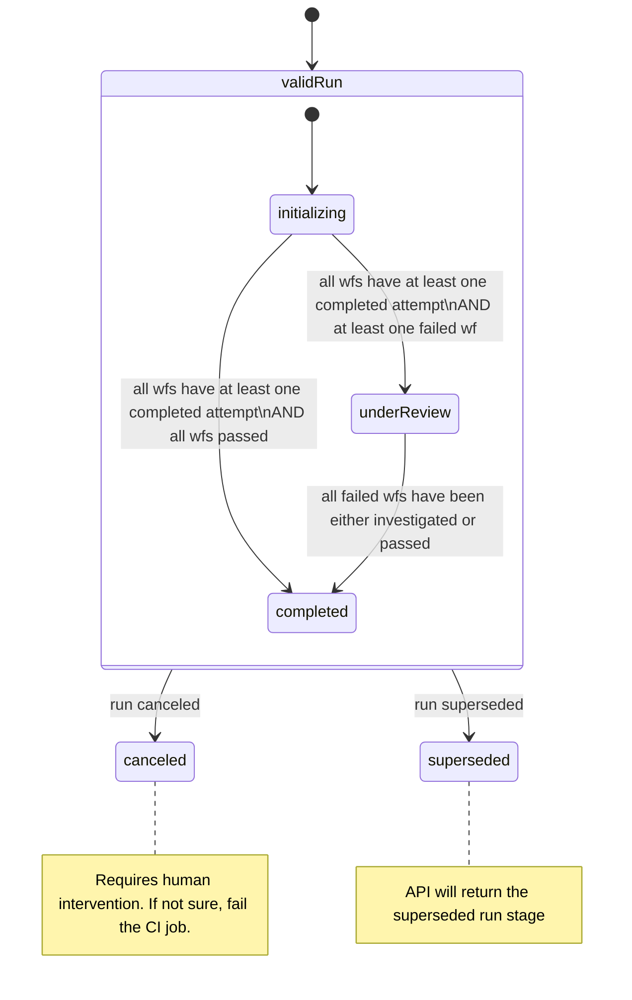

<Note>
This is an experimental v0 endpoint. While marked as experimental, this endpoint is considered stable and versioned and is meant to be backwards compatible. We’re actively collecting feedback on this endpoint and will be releasing v1 in the future. We highly recommend using our JavaScript SDK `pollCiGreenlightStatus` function directly. See [@qawolf/ci-sdk](/qawolf/qawolf-ci-sdk-3fc4cbe1d27f4139b1e33e9a2acd4d6a)
</Note>

This API provides the results of a run into your CI/CD pipeline. This could be just for visibility, but often one would use the results to block (stop, rollback, or revert pending releases and environment promotions).

## Request `/api/v0/ci-greenlight/[root-run-id]`

HTTP Method: GET

### Sample Query

```bash Shell
curl -X GET -H "Authorization: Bearer $apiKey" \
     "https://app.qawolf.com/api/v0/ci-greenlight/$rootRunId?outcomeWhenBlockingBugsInOtherWorkflows=red"
```

<Accordion title="API key">

Go to `https://app.qawolf.com/<team slug>/settings/integrations`

Or, navigate via the UI:

<Columns cols={2}>
<Frame>

</Frame>
</Columns>
<Columns cols={2}>
<Frame>

</Frame>
</Columns>
<Frame>

</Frame>
</Accordion>

### Required Request Headers

| Header Name | Header Value | Description |
| --- | --- | --- |
| `Authorization` | `Bearer api_***` | Provide a string constructed by appending your team API Key to `Bearer`. |

### Optional Query Parameters

| Parameter name | Allowed values | Description |
|:--- |:--- |:--- |
| `outcomeWhenBlockingBugsInOtherWorkflows` | `green` or `red` | EXPERIMENTAL! Defaults to `green`. When set to `red`, greenlight will be `false` when blocking bugs were found in the environment that were affecting workflows not executed in this run. |

## Response

<Info>
Those responses refer to the “run” terminology that is used in the UI, it is synonymous for “suite” in the `deploy_success` webhook.
</Info>

### 200 Response (CI Greenlight status)

The response looks like this:

```json JSON expandable
{
  "blockingBugsCount": 0,
  "greenlight": true,
  "nonBlockingBugsCount": 2,
  "relevantRunId": "***",
  "relevantRunUrl": "https://***",
  "relevantRunWithBugsUrl": "https://***",
  "rootRunId": "***",
  "rootRunUrl": "https://***",
  "runStage": "completed",
  "workflowsDisabledAfterRunCount": 0,
  "workflowsInRunCount": 50,
  "workflowsUnderInvestigationCount": 0,
  "reproducedBugs": [
    {
      "applicationUrl": "https://***",
      "externalIssue": {
        "applicationUrl": "https://***",
        "externalIssueId": "***",
        "platform": "linear"
      },
      "isBlocking": false,
      "isNew": false,
      "name": "Bug 1",
      "number": 1,
      "priority": "low"
    },
    {
      "applicationUrl": "https://***",
      "externalIssue": {
        "applicationUrl": "https://***",
        "externalIssueId": "***",
        "platform": "linear"
      },
      "isBlocking": false,
      "isNew": true,
      "name": "Bug 2",
      "number": 2,
      "priority": "medium"
    }
  ]
}

```

| Field | Description |
|:--- |:--- |
| `greenlight` | Indicates if the relevant run outcome signals safety to release. |
| `relevantRunId` | See [Superseding Logic](/qawolf/CI-Greenlight-1b170576efea411fa785842a71e7c99e#superseding-logic) section below. |
| `relevantRunUrl` | The application URL to the relevant run. |
| `relevantRunWithBugsUrl` | The application URL to the relevant run, with workflows diagnosed as bug filtered out. |
| `rootRunId` | See [Superseding Logic](/qawolf/CI-Greenlight-1b170576efea411fa785842a71e7c99e#superseding-logic) section below. |
| `rootRunUrl` | The application URL to the root run. |
| `runStage` | One of `"initializing"` , `“underReview”` , `"completed"` and `"canceled"`. See [Run Stages](/qawolf/CI-Greenlight-1b170576efea411fa785842a71e7c99e#run-stages) section below. |
| `workflowsDisabledAfterRunCount` | Number of workflows disabled after the review process is completed. This may happen when runs are put under maintenance, but should be relatively rare. |
| `workflowsInRunCount` | Number of workflows in this run. |
| `workflowsUnderInvestigationCount` | Number of failed workflows requiring investigation. |
| `blockingBugsCount`  \* | The number of blocking bugs found or reproduced after review. Present only when `runStage` is `"completed"`. |
| `nonBlockingBugsCount`  \* | The number of non-blocking bugs found or reproduced after review. Present only when `runStage` is `"completed"`. |
| `blockingBugUrls`  \* | An array of URLs to observe all blocking bugs (string). |
| `nonBlockingBugUrls`  \* | An array of URLs to observe all non-blocking bugs (string). |
| `reproducedBugs`  \* | A list of detailed bug objects. |

\* Those fields are only available in the `"underReview"` and `"completed"` run stages.

#### Interpreting the `greenlight` field

The `greenlight` field will be only true when:

- `runStage` is `"complete"` (see [Run Stages](/qawolf/CI-Greenlight-1b170576efea411fa785842a71e7c99e#run-stages)) AND;
- Zero non-blocking bugs were found.

The blocking status is determined by the `priority` bug field. To be blocking, priority has to be at least `"high"` or unset. Newly found bugs have an unset priority and hence are counted as blocking by default.

One can lower the priority of the bug to a non-blocking one in the UI, and then retry one’s "ci-greenlight" job, and it will pass.

<Columns cols={2}>
<Frame caption="A priority select field in the Bug page.">

</Frame>
</Columns>


### HTTP Status Error Codes

| Code | Description |
|:--- |:--- |
| `401` | Missing or invalid credentials. Make sure you are using the `Authorization: Bearer XXX` with `XXX` the API token for your team. |
| `403` | Forbidden. Usually indicates a disabled team. Contact support. |
| `404` | Run not found. |
| `405` | Method not allowed. Make sure you use `GET`. |
| `410` | Gone. That will show-up for old and legacy runs. |
| `500` | Internal server error. If the issue persists, contact support. |

### Superseding Logic

Provided a `rootRunId`, this endpoint will look for superseding runs, and if found it will return the greenlight response for the most recent superseding run. This situation can be identified by comparing `rootRunId` and `relevantRunId`. If these are different, then we are looking at the superseding run greenlight status.

<Warning>
Superseding runs are identified by matching deduplication key. See the relevant documentation here: [Deploy Success Webhook - Advanced Fields](/qawolf/Deploy-Success-Webhook-dd72e46ceb7f451dae4e9ef06f64a2cc#advanced-fields).
</Warning>

<Note>
When polling, it is recommended to reuse the `relevantRunId`. This will result in faster queries as looking up the superseding run can slow down the response time.
</Note>

### Run Stages

The endpoint will return the current stage of the relevant run (replacing the root run with the relevant run as depicted in the [Superseding Logic](/qawolf/CI-Greenlight-1b170576efea411fa785842a71e7c99e#superseding-logic) section above).

<Warning>
A canceled run cannot be recovered and polling should stop thereafter. It is the client discretion to decide whether to submit a new run or call for support.
</Warning>

Run (aka Suite) Stages



Run (aka Suite) Stages
​