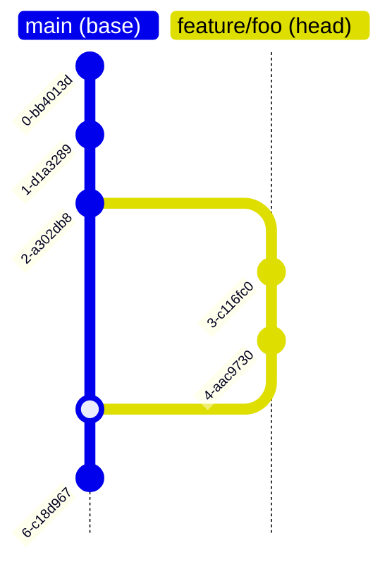
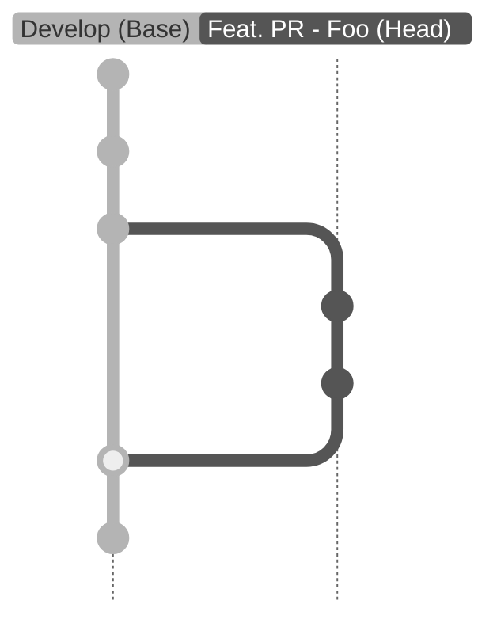

To describe these features properly, we need to introduce a few definitions.

### Definitions

#### Base VCS Branch

The VCS base branch is the branch used to create a new branch. In the context of VCS Branch Testing, we also use this terminology to refer to the branch this new branch will be merged back into.

<Note>
When in doubt, always think of the base as the original branch from which the tested branch was created for the purpose of PR/VCS Branch Testing.
</Note>

#### Head VCS Branch

The new branch created from the VCS Base Branch, which will be the target of QA Wolf testing.

<Note>
When in doubt, always think of the head as the “current branch”, which is the branch being tested by QA Wolf for the purpose of PR/VCS Branch Testing.
</Note>

#### Base Environment

The QA Wolf environment associated with the VCS Base Branch.

#### Head Environment

The QA Wolf environment associated with the VCS Head Branch.

#### Static Environment

A long-lived QA Wolf environment. Often Base Environments in a VCS Branch Testing context. E.g. "Develop".

#### Ephemeral Environment

A short-lived QA Wolf environment. Often Head Environments in a VCS Branch Testing context. E.g. "feature/foo".

#### Environment Compliance

An environment is compliant when no workflow would fail due to lack of code adaptation to the tested product, such as mismatched DOM selectors, intentional behavioural changes, mismatched API schemas... etc.

**Antonym: Environment Staleness**

### Canonical Flow

#### The user notifies a new preview deployment

In this simple example, a VCS branch `feature/foo` is created from `main`, a PR is created from `feature/foo` to `main`, and the customer deploys a preview environment. Once the deployment is up, the customer notifies us about the new deployment using one of those methods [Setting up PR Testing - 2. Notify preview deployments](/qawolf/Setting-up-PR-Testing-03b1adb643b94779be7b4ab77bac755a#2-notify-preview-deployments).

#### Ephemeral environment creation

We look for an ephemeral environment for the PR and, if one has not been created, create one with a copy of the workflows and non-scheduled triggers from the base environment, modifying the branch in the copied triggers.

The base environment is defined by finding the environment in QA Wolf in which the branch matches the PR base VCS branch.

<Frame caption="Environment branch settings on the environment settings page.">

</Frame>

If we can't find a match we will use the Default Base Environment defined in the team settings.

<Frame caption="Environment settings on the team settings screen.">

</Frame>

The newly created environment will have the PR head VCS branch set as the environment branch.

#### Test runs

A test run will start depending on the trigger setup. If the customer deployment notification matches a deployment trigger a run starts as soon as the environment is up. Another possibility is that we have a PR testing button trigger. In that scenario, the test run will only start once the user clicks on the PR button commented in their PR.

<Tip>
We hide ephemeral environments without runs from the UI to reduce noise.
</Tip>

#### Investigation

Tests are executed in the new environment. A QA Wolf investigator reviews any failures, which may result from:

- Changes in product behavior in the new branch.
- A bug causing a failure.

#### Failures

We add failed commit check and comment on the PR any failures, possibly blocking the customer PR.

While QA Wolf is performing maintenance, the VCS branch author provides a fix to the bug.

Subsequently, the customer notifies us of a new deployment, with the fix included, targeting the existing ephemeral environment. A new test run starts and passes.

#### Passes

Once the run passes we add a passing commit check and the PR is unblocked for the merge. Then the `feature/foo` branch is merged into `main`.

#### Promotions

When the PR is merged, QA Wolf is notified. We then identify the corresponding ephemeral environment and attempt to promote its workflows into the base environment. If conflicts arise and the promotion fails, a promotion task is created for a QA Engineer to manually complete the promotion and terminate the ephemeral environment. Otherwise, the promotion and termination occur automatically.

And voilà! Workflows in the `Develop` environment (base environment) are now compliant with the new code hosted in `main`.

If the PR is closed without being merged, we terminate the related ephemeral environment without promoting the workflows.

#### VCS Layout

Typical Trunk-based Layout

#### Environment Layout

Typical Trunk-based Layout

